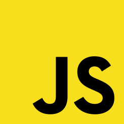

<h1 align="center"> Hola, soy Lara 👋 Bienvenido/a</h1>

<h1 align="flex-start">
   Sobre mí
</h1>

¿Quién soy? 👀  
🔹 Hola! 🙋‍♀️ Soy Lara, una desarrolladora Full Stack (con orientacion al Front-End🤪) de Argentina empezando su carrera en el mundo IT! Sin miedo a los desafíos, con instinto por mejorar y con capacidad de realizar proyectos web teniendo siempre en mente que sean escalables, modularizables y optimizadas para así poder construir en equipo. ⏱ Más allá de los conocimientos técnicos, soy una persona curiosa, que le encanta aprender y enseñar. Me considero una persona detallista, pragmática, proactiva y con buena comunicación. 📣

🤓 ¿Mi Background?  
✔ Terminé mis estudios secundarios y comencé a estudiar la carrera de Medicina hasta que me di cuenta que lo realmente disfrutaba era el mundo IT. 🖥
✔ Ingresé al Bootcamp soyHenry donde, además de profundizar en las distintas tecnologías, aprendí metodologías agiles, a trabajar en conjunto con otros desarrolladores y comunicarme con profesionales que no sean del rubro IT. 👥
✔ Actualmente me encuentro listo para mi primera experiencia laboral en el mundo IT! 😁

<h1>Proyectos</h1>

<li>
FaltaUno! Es una App para el alquiler de canchas y elementos deportivos de diferentes complejos. Cuenta con funcionalidades como: login, paserala de pago, chat interno, calendario y notificaciones, entre otras. Mi trabajo en la app estuvo enfocado en todo lo relacionado con las vistas y funcionalidades de los dueños de canchas, y el panel del administrador.
<li/>
⚽ Link a FaltaUno! https://falta-uno-henry.vercel.app/
 

  

<li>
GameFlix consume data de la API RAWG y de una base de datos local. Esta SPA te permite crear tu propio videojuego, buscar juegos por nombre, filtrar por generos y origen (API o creados por el usuario), y ordenar la busqueda alfabeticamente y por ranking. Al clickear cada videojuego, se podrá observar mas informacion sobre este, como su fecha de lanzamiento y una breve descripcion del juego seleccionado.
<li/>
🕹Link a GameFlix! https://gameflix-zeta.vercel.app/
 

  

 
 

<h1>Mis skills</h1>

   
   
   
   
  
   
   
  
   
   
   
   
   
   
   

<h1>Aprendiendo</h1>

 
 
🔔 Si estás buscando una desarrolladora para sumar a tu equipo, me encantaría saber de vos! 
 
📤 Email: laricorvalan94@gmail.com
 
💼 <a href="https://laracorvalan-portfolio.vercel.app/">Mi Portafolio</a>
 
👥 <a href="https://www.linkedin.com/in/lara-corvalan-fullstack/">Mi LinkedIn</a>
 

